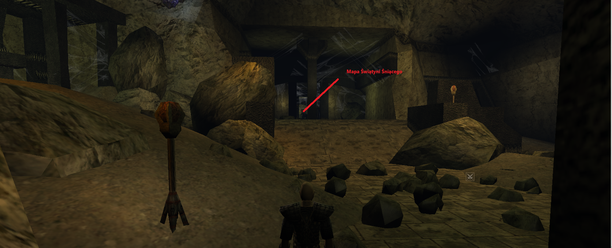
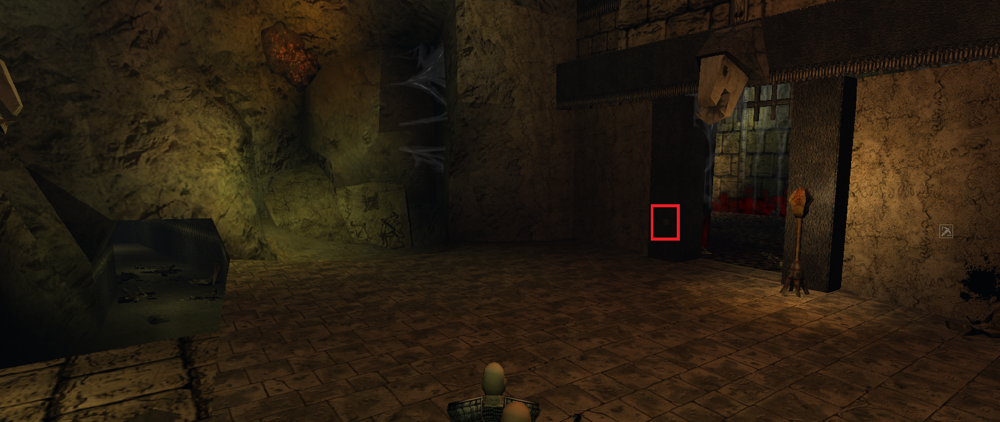

:::info Informacja

Rozpoczyna się po zadaniu **Powrót do kopalni**

:::

------

## Świątyni Śniącego {#swiatyni-sniacego}
**Zleca: Zadanie aktywuję się po przywołaniu Śniącego**

Wyruszamy razem z Cor Volosem, Gor Ringirem, Baal Vasilim, Gor Lumanem i Gor Kumarem do Świątyni Śniącego na terytorium orków. Po wejściu do świątyni oczyszczamy ją z zombie, a naszym celem staje się odnalezienie mapy Świątyni Śniącego:

Po zdobyciu mapy wracamy na początek lokacji, gdzie znajdują się kraty. Gdy je otworzymy, kierujemy się najpierw w prawą odnogę korytarza aby ją zwiedzić, po czym wracamy i ruszamy w lewą stronę. Na końcu lewej odnogi naciskamy przycisk znajdujący się na ścianie obok lewych krat:

Następnie musimy aktywować przełączniki w odpowiedniej kolejności: *Czerwony*, *Żółty*, *Niebieski*. Po ich przekręcniu ruszamy dalej. Cor Elvardo radzi, byśmy najpierw udali się w prawo — tam odkrywamy **alternatywną drogę** prowadzącą do centralnej budowli. Omijamy ją z prawej strony i wskakujemy do środka przez dziurę. W środku odnajdujemy Ciężki Pancerz Starożytnych. Podążamy dalej gdzie w g1 spotykamy jednego z szamanów, a później napotykamy Garasha. Po wykonaniu zadań: **Los Korika**, **Cor Arvar**, oraz **Czerwona Przysięga**, kontynuujemy wyprawę, aż docieramy do Y’Fishora. Przed walką z nim mamy do wyboru jeden z trzech poziomów trudności.

:::info Informacja

Po starciu z Y'Fishorem, udajemy się na Plac Wymian.

:::

## Test wiary {#test-wiary}
**Zleca: Garash**

Garash otworzył portal, wyślę on każdego do innego świata, w którym musimy zrobić poniższe zadania.

## Pamiętnik Korika {#pamietnik-korika}
**Zleca: Baal Feleon**

W innym świecie otwartym przez Garasha, Baal Feleon prosi nas o przyniesienie mu 200 roślin bagiennego ziela. Podążamy więc za Gor Na Raniorem, odbieramy paczkę od Thotlenosa i wracamy do Baala.

## Cor Arvar {#cor-arvar}
**Zleca: Gornatum**

Po wykonaniu zadania **Pamiętnik Korika** jeden z Gornatum mówi, że Cor Arvar chce się widzieć z Gor na Raniorem. Idziemy więc na początek lokacji, znajduje się on w Świątyni, zada on nam 3 pytania, na które kolejno odpowiadamy:

1. Y'Petriadoch, Y'Horas,
2. Zwiekszał jego moc i charyzmę,
3. Rozpoczął wojnę orkami.

Po 3 pytaniach, udajemy się z powrotem na most, gdzie pojawia się Gor Na Ranior. Przekazuje nam wiadomość, że Cor Arvar wzywa nas na Górę Świątynną, więc udajemy się tam.

## Czerwona przysięga {#czerwona-przysiega}
**Zleca: Cor Arvar**

Cor Arvar podjął decyzję. Moim przeciwnikiem będzie Gor Na Falgar. Idziemy się przespać, a następnie mamy odebrać miecz z kuźni. Kuźnia znajduję sie przed bramą na prawo gdy patrzymy na nią. Od kowala wraz z mieczem dostajemy też zwój teleportacji na arenę, na której musimy zmierzyć sie z Gor Ringirem. Po walce idziemy do Rengara.

:::info Informacja

Po walce wracamy do tego świata, w którym byliśmy przed wysłaniem - [Świątyni Śniącego](#swiatyni-sniacego).

:::
